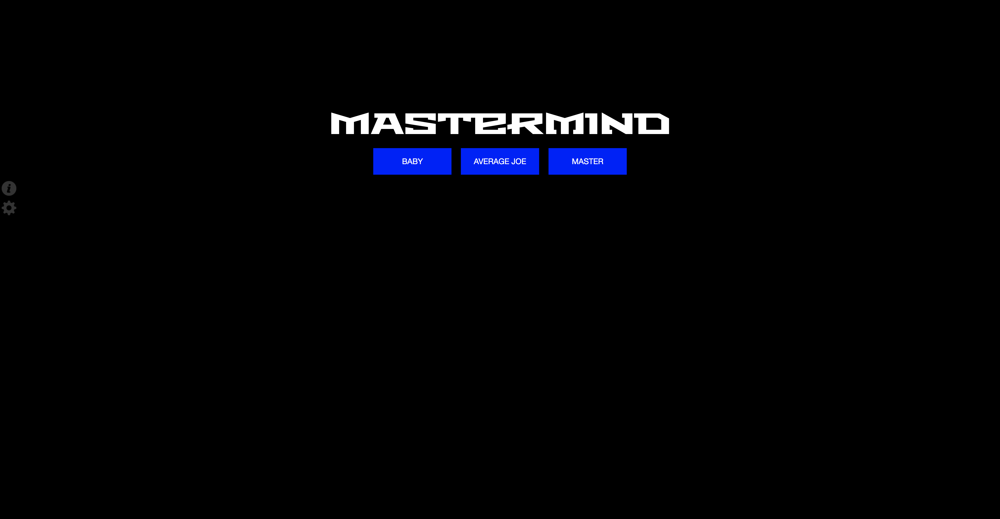
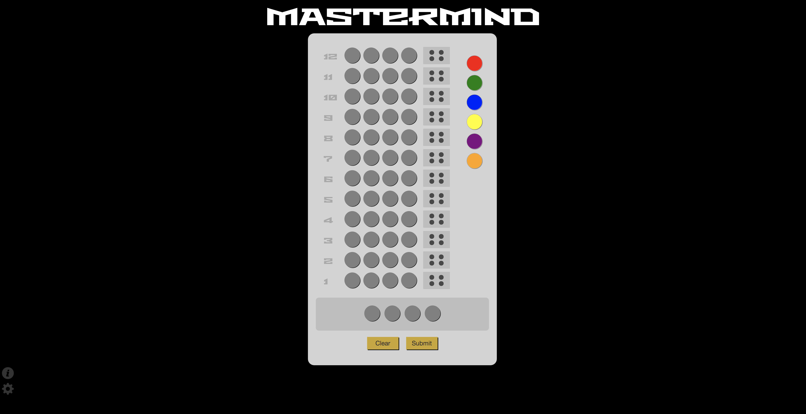

# _Mastermind_

#### _A web app for a code breaking game, 11.08.2018_

#### By **_Daniel Bennett, Alex Garcia, Jared Reando, and Kristin Brewer-Lowe_**

## Description

_A website that lets the user play the board game "Mastermind". In this game the user is tasked with trying to solve a code that is generated by guessing which of the colors is correct. The game lets the user know how close they are by displaying different colored pegs, gold pegs means that the user now has a color and the correct position in place, a green/white peg means the user has a correct color. The game is over when either the player correctly guesses the pattern, or the users take more then the given turns to guess and lose._

## Setup/Installation Instructions

_Run game from GithubPages at:_

## Known Bugs

* _No known bugs._

## Specifications

* Choose Difficulty.
    * Example Input: "DifficultyValue"
      * Example Output: Program outputs board size, and other difficulty settings based of selection.

* Program creates Master Configuration
    * Example Input: "DifficultyValue"
      * Example Output: MasterConfig of colors (either 4 or 6) depending on selection

* Guess Selection of Colors
    * Example Input: Clicking one of the colors along right side.
      * Example Output: Will fill staging board from left to right until 4 colors are chosen.

* Error if 4 colors are not selected
    * Example Input: 1, 2, or 3 colors are selected and the submit button is clicked.
      * Example Output: Modal will appear telling users they must select 4 colors to continue.

* Making a Valid Guess
    * Example Input: 4 colors are inputted into staging board and submit is clicked.
      * Example Output: This will compare the selected colors to the master Configuration, push the array to it's corresponding div, and show peg results.

* Peg results
    * Example Input: 4 colors are inputted into staging board and submit is clicked.
      * Example Output: If colors are correct the board will display a green/white peg for each of those correct. If the colors are correct and in the correct position in the array the board will display a gold peg. No color will show if the guess is wrong.

* Losing a game
    * Example Input: All turns have been used up without finding the correct pattern.
      * Example Output: The game will show a modal informing users of the lose.

* Winning a game
    * Example Input: The users guess matches the master Configuration.
      * Example Output: The game will show a modal informing the player of a win.

* Starting a New Game
    * Example Input: User clicks play again.
      * Example Output: The game resets the board, clears colors, and configures a new master config.

* Showing Info
    * Example Input: Hovering over the info button.
      * Example Output: Shows rules of game as well as peg info.

* Cheat Button
    * Example Input: When clicking on the "c in Mastermind" (e)
      * Example Output: The input will be filled with the master Configuration.

## Support and Contact Details

_If you discover a bug or want to make a suggestion or comment, send us an email at g.nightster11@gmail.com, daniel.bennett1999@gmail.com, kristin.lowe1@gmail.com, or jaredreando@gamil.com or file an issue on Github._

## Technologies Used

_This portfolio uses CSS, HTML, Javascript, JQuery, Bootstrap 3.7, Glyphicons, and Metroregular._

### License

Copyright (c) 2018 **_Daniel Bennett, Alex Garcia, Jared Reando, and Kristin Brewer-Lowe_**

This software is licensed under the MIT license.
